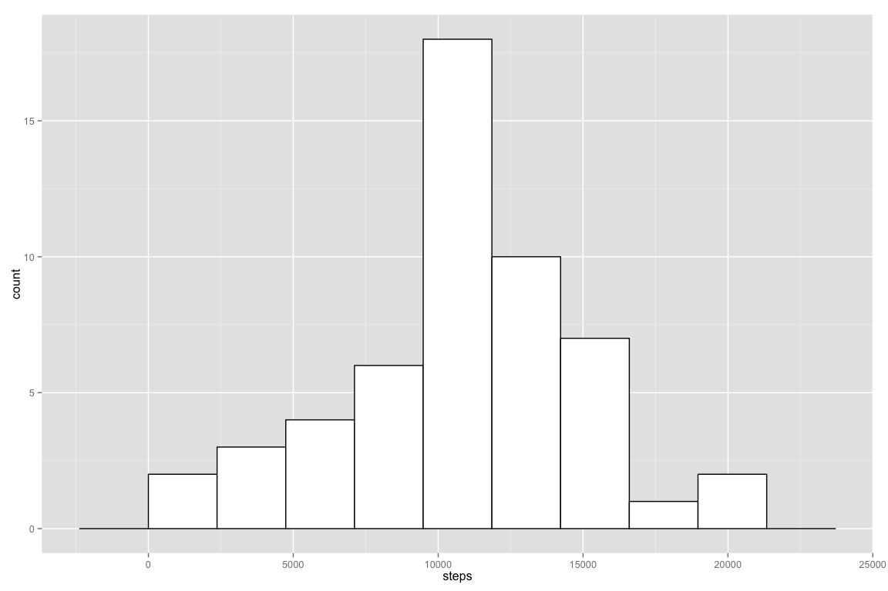
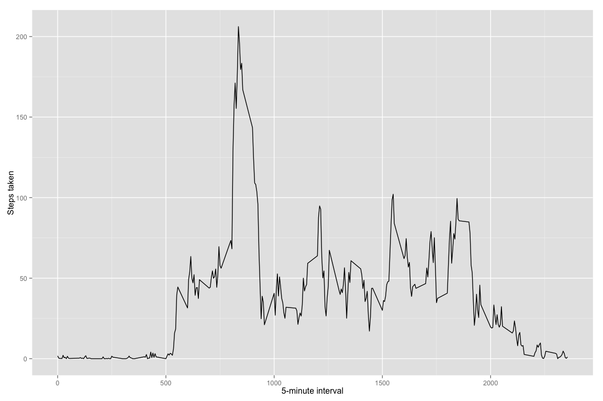
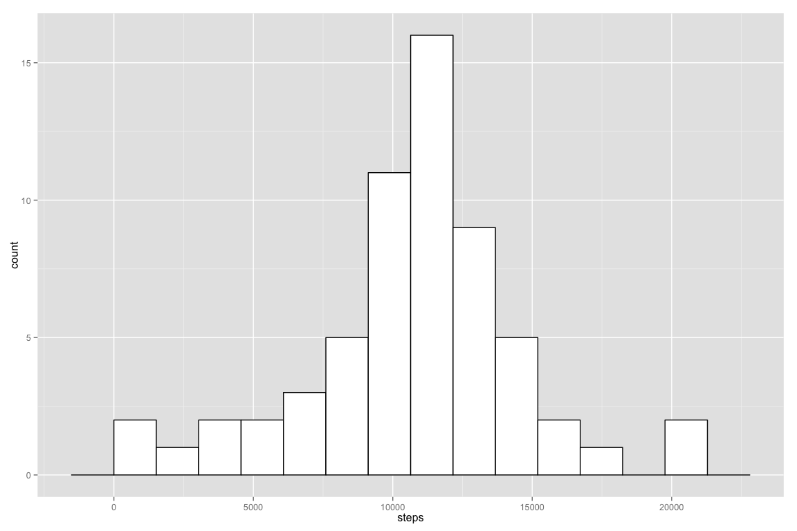
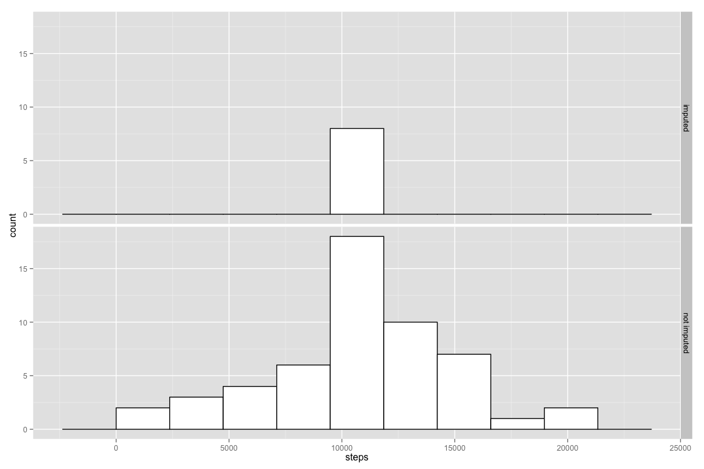
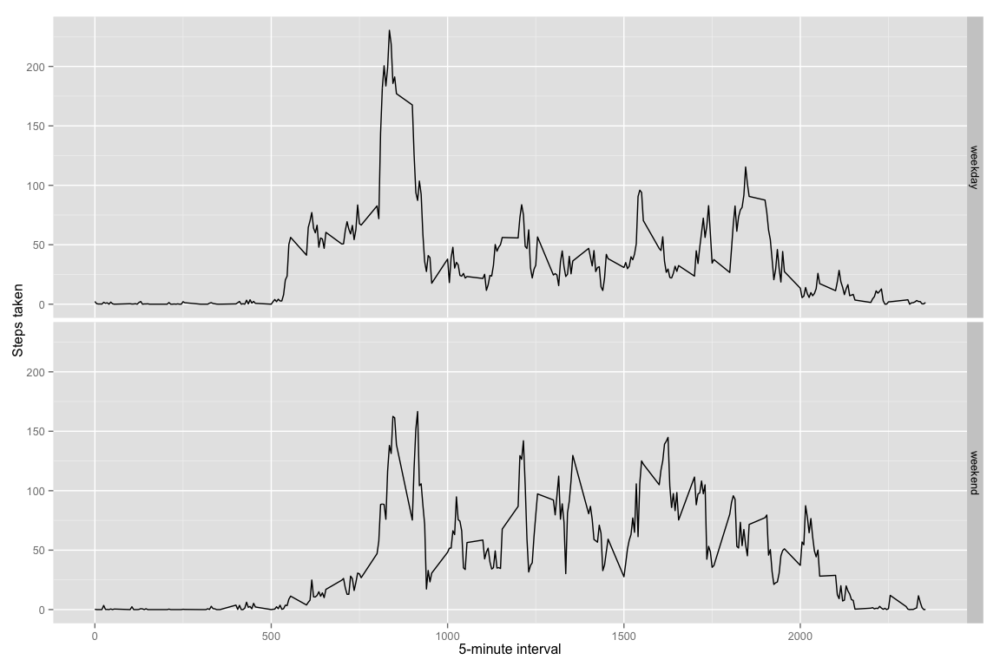

# Reproducible Research: Peer Assessment 1

Please note, if you want to see the images embedded in the narrative, view `PA_template.md` instead of
`PA_template.Rmd`
### Loading and preprocessing the data
*Note: You'll need to have activity.zip in the working directory.*


```r
unzip("activity.zip")
activity <- read.csv("activity.csv")
activity$date <- as.Date(activity$date)
```


### What is mean total number of steps taken per day?

Histogram of total number of steps taken each day:  
*note: I used the 
[Freedman-Diaconis rule](http://stats.stackexchange.com/questions/798/calculating-optimal-number-of-bins-in-a-histogram-for-n-where-n-ranges-from-30) for number of bins as the default Sturges method didn't seem
to adequately show the distribution.*

```r
library(dplyr)
library(ggplot2)
sum_steps_day <- activity[complete.cases(activity),] %>% group_by(date) %>% summarize( steps = sum(steps))
bw <- 2 * IQR(sum_steps_day$steps) / length(sum_steps_day$steps)^(1/3)
ggplot(sum_steps_day, aes(x=steps)) + geom_histogram(binwidth=bw, color="black", fill="white")
```

 

Numeric mean and median steps per day:

```r
paste("mean steps per day:", round(mean(sum_steps_day$steps)))
```

```
## [1] "mean steps per day: 10766"
```

```r
paste("median steps per day:", round(median(sum_steps_day$steps)))
```

```
## [1] "median steps per day: 10765"
```


### What is the average daily activity pattern?
*assuming NAs are still omitted*  
Time series plot of average daily activity pattern:

```r
daily_pattern <- activity[complete.cases(activity),] %>% group_by(interval) %>% 
        summarize( mean_steps = mean(steps))
ggplot(daily_pattern, aes(interval, mean_steps)) + geom_line() +
         xlab("5-minute interval") + ylab("Steps taken")
```

 

The 5-minute interval, on average across all days, containing the maximum number of steps:

```r
paste("Maximum step interval:", daily_pattern %>% filter(mean_steps == max(mean_steps)) %>%
        select(interval))
```

```
## [1] "Maximum step interval: 835"
```


### Imputing missing values

Total number of rows with missing values:

```r
to_impute <- activity[!complete.cases(activity),]
paste("Observations with missing values:", nrow(to_impute))
```

```
## [1] "Observations with missing values: 2304"
```

Replace missing values with rounded mean for that interval

```r
imputed <- inner_join(activity, daily_pattern, by="interval")
imputed$label <- ifelse(is.na(imputed$steps), "imputed", "not imputed")
imputed$steps <- ifelse(is.na(imputed$steps),round(imputed$mean_steps), imputed$steps)
imputed <- imputed[,-4]
```

Histogram of the total number of steps taken each day using imputed values

```r
imputed_day <- imputed %>% group_by(date, label) %>% summarize(steps = sum(steps))
bw2 <- 2 * IQR(imputed_day$steps) / length(imputed_day$steps)^(1/3)
ggplot(imputed_day, aes(x=steps)) + geom_histogram(binwidth=bw2, color="black", fill="white")
```

 


Comparison of mean and median.  
*note: there is negligible impact*

```r
library(xtable)
na_dropped <- as.integer(c(round(mean(sum_steps_day$steps)), round(median(sum_steps_day$steps))))
imputes <- as.integer(c(round(mean(imputed_day$steps)), round(median(imputed_day$steps))))
df <- data.frame(na_dropped, imputes)
rownames(df) <- c('mean', 'median')
print(xtable(df, caption="Comparison of dropping NAs vs imputing missing values",
             floating=FALSE), type="html")
```

<!-- html table generated in R 3.1.2 by xtable 1.7-4 package -->
<!-- Wed Jun 10 16:24:46 2015 -->
<table border=1>
<caption align="bottom"> Comparison of dropping NAs vs imputing missing values </caption>
<tr> <th>  </th> <th> na_dropped </th> <th> imputes </th>  </tr>
  <tr> <td align="right"> mean </td> <td align="right"> 10766 </td> <td align="right"> 10766 </td> </tr>
  <tr> <td align="right"> median </td> <td align="right"> 10765 </td> <td align="right"> 10762 </td> </tr>
   </table>


For giggles, I compared the imputed only and not imputed values.  Notice that imputed values appear to add to the center off the distribution.

```r
ggplot(imputed_day, aes(x=steps)) + geom_histogram(binwidth=bw, color="black", fill="white") +
        facet_grid(label ~ .)
```

 


### Are there differences in activity patterns between weekdays and weekends?
*note: using imputed values for this section*  
Patterns appear slightly different (see below).

```r
imputed$weekpart <- as.factor(ifelse(weekdays(imputed$date) %in% c("Saturday", "Sunday"), 
                                         "weekend", "weekday"))
daily_impattern <- imputed %>% group_by(interval, weekpart) %>% summarize( steps = mean(steps))
ggplot(daily_impattern, aes(interval, steps)) + geom_line() +
        facet_grid(weekpart ~ .) + xlab("5-minute interval") +
        ylab("Steps taken")
```

 

